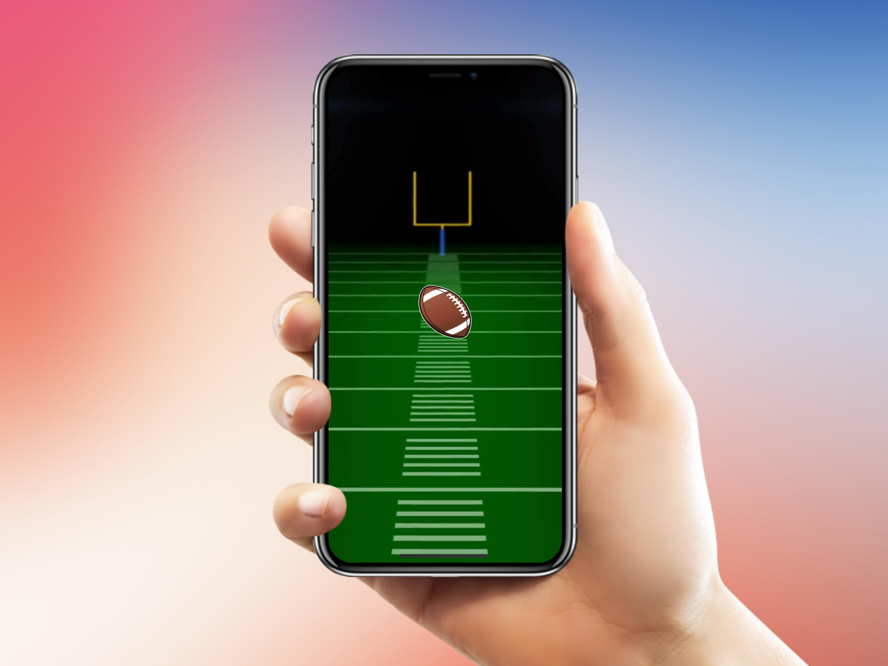

# Gesture Recognizers in iOS and Swift
This project shows how to use multiple UIGestureRecognizers subclasses all programmatically without the usage of UIStoryboard and Interface Builder.

___
## Example how the UI looks

